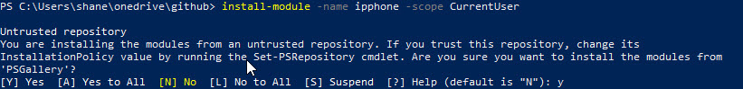

# Recommended Installation Method

### Install the IP Phone Module 
To install the IP Phone module with PowerShellGet 

```
Install-Module -Name ipphone -Scope CurrentUser
```



### Update the IP Phone Module 
To update the IP Phone module with PowerShellGet 

```
Install-Module -Name ipphone -Scope CurrentUser
```

### List Commands
List all commands in IP Phone Module

```
Get-Command -Module ipphone
```

# Checking SSL Trust 
By default your computer may not trust the SSL certifcate on the IP Phone, this command will check if your computer trusts the IP Phone SSL certificate

```
test-ipphoneTrustCertPolicy -ipphone 172.16.18.131
```

if the  IP Phone is not trusted modify the trust cert policy (powershell core you use -skipcertificatecheck instead). Any changes are only valid for the current shell, if you close powershell the TrustAllCertPolicy will be reverted

```
set-ipphoneTrustAllCertPolicy
```

# Example Usages

### Login Single IP Phone

The following example will log an AudioCodes IPP Phone on remotely. 

 * __ipphone__ Is the IP Address or FQDN of the IP Phone you want to log onto
 * __ippcredential__ Is the Credential(username/password) of the IP Phone (default is admin/1234)
 * __sipaddress__ Is the sip address of the user that you want to log the phone in as
 * __sipcredential__ Is the credential(username/password) of the user that you want to log the phone in as 

```
set-ipphoneTrustAllCertPolicy

$ipphone = “172.16.18.135”
$ippcredential = get-credential -Message "Credential" -UserName "admin"

$sipaddress = “shane@shoey.xyz”
$sipcredential  = get-credential -Message "Credential" -UserName $sipaddress

$websession  = new-ipphonewebsession -ipphone $ipphone
connect-ipphone -ipphone $ipphone -credential $ippcredential -websession $websession 
Invoke-ipphoneLoginUser -ipphone $ipphone -sipcredential $sipcredential -sipaddress $sipaddress -websession $websession
```

### Logon Single IP Phone (using Office 365 CLoud login)

The following example will log an AudioCodes IPP Phone on remotely. 

 * __ipphone__ Is the IP Address or FQDN of the IP Phone you want to log onto
 * __ippcredential__ Is the Credential(username/password) of the IP Phone (default is admin/1234)

```

set-ipphoneTrustAllCertPolicy

$ipphone = “172.16.18.135”
$ippcredential = get-credential -Message "Credential" -UserName "admin"

$websession  = new-ipphonewebsession -ipphone $ipphone
connect-ipphone -ipphone $ipphone -credential $ippcredential -websession $websession 
Invoke-ipphoneLoginUser -ipphone $ipphone -cloud -websession $websession

get-ipphonestatus -ipphone $ipphone -websession $websession 

```

### Logoff Single IP Phone

The following example will logoff the current logged in user of an AudioCodes IPP Phone. 

 * __ipphone__ Is the IP Address or FQDN of the IP Phone you want to log onto
 * __ippcredential__ Is the Credential(username/password) of the IP Phone (default is admin/1234)
 

```

$ipphone       =  “172.16.18.135”
$ippcredential = get-credential -Message "Credential" -UserName "admin"

$websession  = new-ipphonewebsession -ipphone $ipphone
connect-ipphone -ipphone $ipphone  -credential $ippcredential -websession $websession
Invoke-ipphoneLoginUser -ipphone $ipphone -logoff -websession $websession

```

### Scan Subnet and Log IP Phones using a JSON file

The following example will log an AudioCodes IPP Phone based on a json file. It will scan the subnet given and only logon to the phone if the MAC address matches 


The following information is required in the json file 
 * __mac__ is the mac address of the IP Phone in format 00-00-00-00-00-00
 * __username__ is the username of the account you want to log the phone in as  (username@domain or domain\username)
 * __sipaddress__ is the sip address is the credentials of the user that you want to log the phone in as
 * __password__ is the password of the Users
 
 __Storing Password in JSON file__
 If you are storing the password do not use cleartext instead use securestring and copy the resulting string into the json file. 
 
 `"mypassword" | ConvertTo-SecureString -AsPlainText -Force | ConvertFrom-SecureString`
 
 The password is only valid when logged in as the same user/same password as it was created with.

__Storing Clear Text Password in JSON file__
Do Not do this! Storing passwords in a text file in clear text is a security risk, do not do this! 
If you must do this then use the -cleartext parameter.

__Convert CSV to Json__

if you prefer to store the file in csv format you can do the following to convert it into JSON prior to importing it. 

```
get-content .\phones.csv | ConvertFrom-Csv | convertto-json | Out-File .\phones.json
```

_JSON FILE_
```
[
  {
    "mac": "00-90-8F-00-00-00",
    "username": "shane@shoey.example",
    "sipaddress": "shane@shoey.example",
    "password": null
  },
  {
    "mac": "00-90-8F-00-00-00",
    "username": "debra@shoey.example",
    "sipaddress": "debrab@shoey.example",
    "password": null
  }
]
```

_Script_

NOTE:  This script is currently seperate to the module and you must download seperatly

[Link to Script](https://github.com/shanehoey/ipphones/blob/master/scripts/invoke-ipphoneScanLogin/invoke-ipphoneScanLogin.ps1)

```
./invoke-ipphoneScanLogin.ps1 -subnet "172.16.18." -first 131 -last 132 -file .\PRIVATE-phones.json

```

### Scan Subnet and perform Maintenance Actions

NOTE:  This script is currently seperate to the module and you must download seperatly

[Link to Script](https://github.com/shanehoey/ipphones/blob/master/scripts/invoke-ipphoneScanMaintenanceTask/invoke-ipphoneScanMaintenanceTask.ps1)

```
# Reboot ALL Phones in subnet 
./invoke-ipphoneScanMaintenanceTask.ps1 -subnet "172.16.18." -first 131 -last 132

# Factory Default ALL Phones in subnet 
./invoke-ipphoneScanMaintenanceTask.ps1 -subnet "172.16.18." -first 131 -last 132 -FactoryDefault

#Log Off Phones ALL Phones in subnet
./invoke-ipphoneScanMaintenanceTask.ps1 -subnet "172.16.18." -first 131 -last 132 -logoff

```
